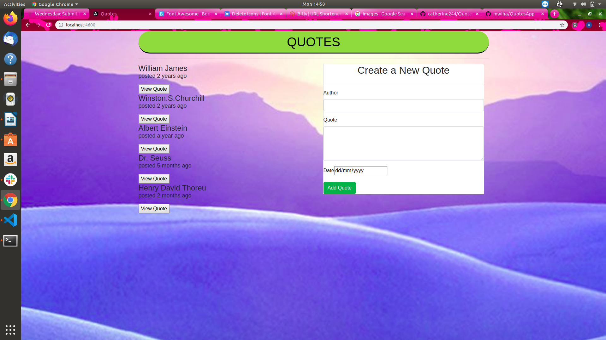

# Quotes

## Author
- Alice Mwihaki

## Description

- This Application is designed for inspiration quotes.

## BDD

- The application allows the user to add quotes,Author in the form card. The user is also able to like or dislike the quotes.Once the user clicks on the submit button, it sends an alert message that the request has been received,then the quote is dislayed.

## Technology Used
- Angular
- HTML
- css
- Typescript
- Bootstrap

## SetUp Instructions
- Clone this repository to a location in your file system.
- Open terminal command line then navigate to the root - - folder of the application.
- Run ng serve command.
- Navigate to http://localhost:4600/ in your browser.

## Known Bugs

- Not known bugs

## contacts information

- For more information,questions or comments:
(alicemwihaki99@gmail.com)

## Licence

- This project is Licensed under MIT. ©2019 Copyright Alice Mwihaki.
